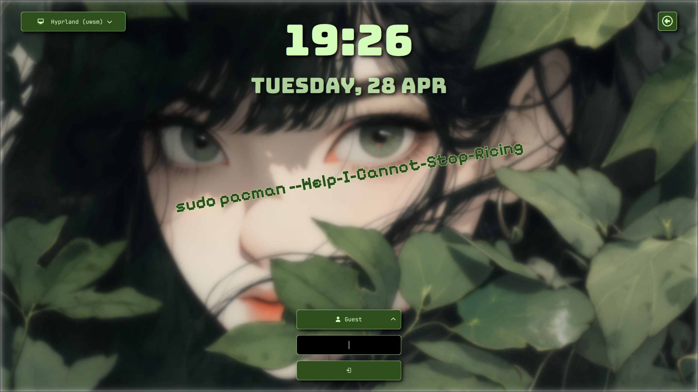

### Introduction
1. This is a SDDM Display Manager theme
2. It works on Qt 6 (Dependencies = qt6-declarative qt6-quickcontrols2 qt6-5compat)
3. It will look as shown in the first preview image, but it can also hook into your [matugen](https://github.com/InioX/matugen) config and change it's appearance based on the selected color.

### Preview


### Installation Steps
1. Clone this Repository
2. Copy the subfolder `reactive` to /usr/share/sddm/themes
```
sudo cp -r reactive /usr/share/sddm/themes/
```
3. Inside /usr/share/sddm/themes/reactive, **chown** the files `Matugen.qml` and `assets/background` (Very important for dynamic matugen theme)
```
cd /usr/share/sddm/themes/reactive
sudo chown $USER:$USER Matugen.qml assets/background
```
4. Edit `/etc/sddm.conf` and set theme value to `matudm:
```
..
..
[Theme]
#Current theme name
Current=reactive
..
..
```

5. Copy the file `sddm.qml` to `~/.config/matugen`
   
6. Inside `~/.config/matugen/config.toml` add the config:
```
[templates.sddm]
input_path = '~/.config/matugen/sddm.qml'
output_path = '/usr/share/sddm/themes/reactive/Matugen.qml'
post_hook = "cp {{image}} /usr/share/sddm/themes/reactive/assets/background"
```